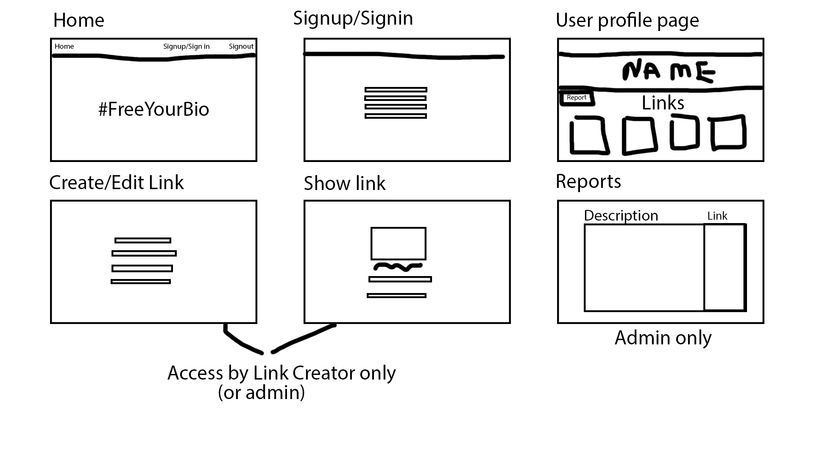

# Planning for #FreeYourBio

## What it is

#FreeYourBio is an app that allows users to make a page where someone with the link can view all their social media links.

## Problem it solves

Have you ever seen someones social media bio who is trying to grow online?
Often they look like this:  
"Add me on snap:  
Insta:  
Facebook/Twitter/YouTube:  
etc.  
Some words...[oops! Out of characters can't write about themselves]"

My app aims to turn your bio from that mess that takes up all the space to write about yourself into a single link. Most social medias even include a website link spot so you can totally #FreeYourBio.

## Wireframes

## Features

* List many supported social medias as well as any website links you want for unsupported sites.
* User Authentication
* Add titles to links
* CRUD on links
* No need to do much for supported sites, images and urls are set for you based on a username input, if an unsupported site has a primary meta image it will also be set for you

Gold level features:

* Keep track of link clicks / profile visits
* Organize your links
* Embed your profile on other sites
* Embed a YouTube video on your page
* Choose the background color/styling for your page

## MVP

* crud on links

## Bronze

* user authentication
* add links to users

## Silver

* Admin abilities

## Gold

* report system
* custom user styles for their profiles
* link click tracking
* embed youtube video
* allow a way to embed your profile from #FreeYourBio on your own site
* organize order links are displayed

## Models

### User Model:

username: string  
email: string  
password: string  
admin: boolean
has_many: links

### Link Model:

Title: string  
Site: string  
Url: string  
Img: string  
belongs_to: user

## Notes

input type color for color selecting
https://github.com/plataformatec/devise/wiki/How-To:-Allow-users-to-sign-in-using-their-username-or-email-address
https://github.com/plataformatec/devise/wiki/How-To:-Redirect-to-a-specific-page-on-successful-sign-up-(registration)
